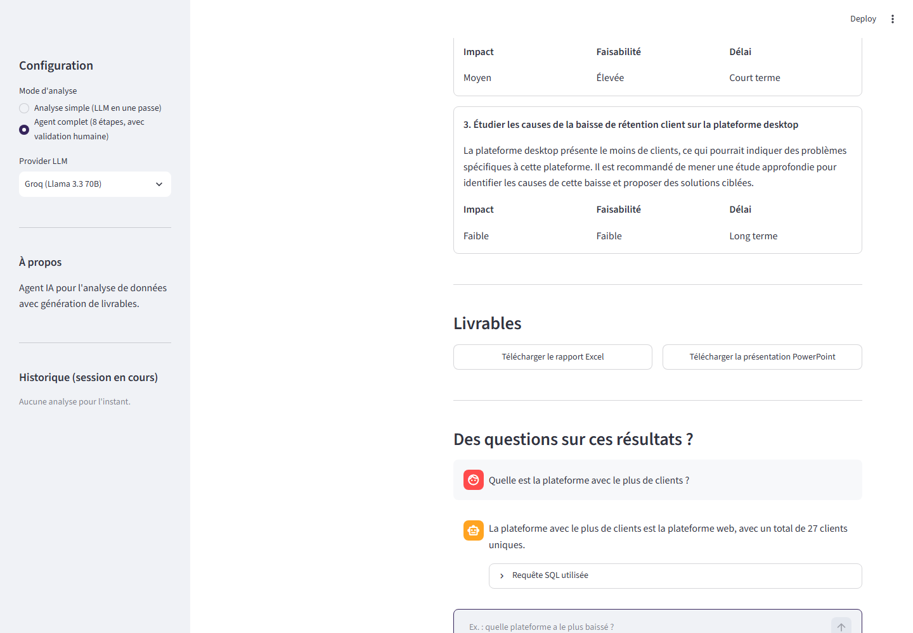

# ai-data-agent

**Agent IA open source pour l'analyse de données, conçu pour raisonner comme un analyste, pas seulement générer du SQL.**

`ai-data-agent` transforme une question métier en une analyse structurée, vérifiée et actionnable. Au lieu de produire une réponse en une seule passe, l'**agent** suit un workflow d'analyste : il cadre le problème, inspecte les données, **s'arrête pour demander une validation humaine**, construit l'analyse, la teste, la valide, puis formule des recommandations classées par impact et faisabilité.

Le projet est construit avec **LangGraph** (orchestration multi-étapes avec état persistant), **DuckDB** (moteur analytique en mémoire), **Streamlit** (interface web) et un **serveur MCP** qui expose la base à n'importe quel assistant IA compatible (Claude Desktop, VS Code…).

> **Deux interfaces, un même agent.** L'**agent LangGraph en 8 étapes** (avec point de contrôle humain) s'exécute en CLI via `python -m agent.main`, ou depuis l'**application Streamlit** (`app.py`) en sélectionnant le mode « Agent complet ». L'app garde aussi son mode « Analyse simple » d'origine (analyse LLM en une seule passe, sans le graphe) pour une utilisation rapide sur n'importe quel CSV — voir [Utilisation](#utilisation).

---

## Pourquoi ce projet

La plupart des outils « text-to-SQL » sautent directement à la requête et produisent des réponses plausibles mais non vérifiées. `ai-data-agent` reproduit la démarche d'un analyste senior :

- **Cadrer avant de calculer** : définir la métrique de façon opérationnelle et reformuler la question de manière testable évite de partir dans la mauvaise direction.
- **Human-in-the-loop** : l'agent marque une vraie pause après l'inspection des données (point d'interruption LangGraph natif, pas un simple `input()`) et attend une approbation explicite avant de lancer l'analyse — en CLI comme dans l'interface Streamlit.
- **Traçabilité** : chaque étape est journalisée dans un *audit trail*, et l'état complet est persisté (SQLite) pour être repris ou audité.
- **Livrables prêts à l'emploi** : export Markdown, CSV, Excel et PowerPoint. Le mode simple les génère depuis l'analyse LLM en une passe ; l'agent en 8 étapes génère ses propres Excel/PowerPoint à partir de ses résultats réels (métrique construite, facteurs explicatifs, validation, recommandations), avec une vérification automatique de cohérence entre les deux fichiers, téléchargeables directement depuis l'interface Streamlit.

---

## Fonctionnalités

- **Workflow d'agent en 8 étapes** orchestré par LangGraph avec état typé (Pydantic) et checkpointing SQLite, accessible en CLI et depuis l'interface Streamlit.
- **Point de contrôle humain réel** (human-in-the-loop) après l'inspection des données : le graphe est compilé avec `interrupt_before`, un vrai mécanisme de pause/reprise LangGraph — pas un `input()` bloquant dans le nœud. En CLI, la décision se saisit dans le terminal ; dans Streamlit, via deux boutons (« Approuver » / « Rejeter »).
- **Inspection automatique des données** : schéma, volumétrie, plage de dates, valeurs manquantes, doublons, besoin d'agrégation, et détection de la colonne identifiant une entité (ex. `customer_id`) si elle existe.
- **Agnostique au schéma** : `build`/`test`/`validate` s'adaptent aux colonnes réellement présentes (identifiant d'entité et colonne de date détectés automatiquement, sinon repli sur un simple comptage de lignes) plutôt que de supposer un schéma de rétention client fixe.
- **Analyse des facteurs explicatifs** : comparaison de la métrique selon les colonnes catégorielles disponibles (plateforme, région, segment, ou toute autre colonne du CSV), avec un test du chi² d'ajustement par dimension pour distinguer un écart statistiquement significatif (p < 0.05) du bruit d'échantillonnage — les recommandations sont explicitement priorisées sur les dimensions significatives. Les colonnes trop fragmentées (plus de 30 catégories distinctes, ex. un commentaire libre ou un second identifiant) sont exclues de ce test plutôt que de produire un faux signal statistique.
- **Étape de validation** : rapprochement des comptes, vérification de reproductibilité et de cohérence des résultats.
- **Recommandations classées** par impact, faisabilité et délai.
- **Export automatique Excel/PowerPoint** : le dernier nœud du graphe régénère un classeur Excel (métrique construite, un onglet par facteur explicatif, validation) et une présentation PowerPoint à partir des résultats réels de l'analyse, puis vérifie automatiquement que les chiffres des deux fichiers concordent.
- **Chat de suivi sur les résultats** (mode Agent complet) : une fois l'analyse terminée, une question en langage naturel peut être posée dans un chat sous les résultats. L'assistant décide lui-même s'il doit interroger la table DuckDB de l'analyse pour répondre (ex. « combien de clients uniques sur mobile ? ») ou s'appuyer directement sur le résumé déjà calculé — la requête SQL générée est soumise au même garde-fou de lecture seule que le serveur MCP, et affichée pour transparence à côté de la réponse.
- **Pipeline de streaming** : surveillance d'un dossier (watchdog) qui déclenche une analyse à l'arrivée d'un nouveau fichier, mais uniquement quand le détecteur d'anomalies par z-score (`AnomalyDetector`) juge la volumétrie anormale (ou, au tout début, tant qu'il n'a pas assez d'historique pour juger) — pas à chaque fichier reçu. Deux modes explicites : approbation automatique (`require_approval=False`, par défaut) ou mise en attente explicite (`require_approval=True`, avec `pipeline.approve(thread_id)` / `.reject(thread_id)`). Les livrables Excel/PowerPoint de chaque analyse terminée sont copiés dans `./outputs/stream/` sous un nom dérivé du fichier source.
- **Serveur MCP DuckDB** : expose la base analytique aux assistants IA compatibles MCP. `execute_query` est restreint aux requêtes de lecture (`SELECT`/`WITH`/`DESCRIBE`/`SHOW`/`EXPLAIN`, une seule instruction) — un assistant externe ne peut ni modifier le schéma ni écrire dans la base via cet outil.
- **Interface Streamlit** : deux modes sélectionnables. « Analyse simple » (upload jusqu'à 5 fichiers CSV, nettoyage automatique, analyse LLM en une passe, export Markdown / CSV / Excel / PowerPoint) et « Agent complet » (le workflow LangGraph en 8 étapes ci-dessus, avec un onglet indépendant par fichier téléversé — cadrage, inspection, validation humaine et livrables propres à chacun). Chaque session Streamlit utilise ses propres fichiers DuckDB/checkpoint pour ne pas interférer avec les autres utilisateurs d'un déploiement partagé.
- **Multi-provider LLM avec repli en cascade** : Groq, OpenRouter, Mistral essayés dans l'ordre (chacun avec sa propre clé, celle demandée en premier) ; Gemini reste utilisable si explicitement demandé mais exclu du repli automatique (accès payant sur de nombreux comptes désormais). Un quota épuisé ou une panne se traduit par un avertissement clair côté utilisateur (pas une trace d'erreur brute) tant qu'au moins un autre provider est configuré.
- **Sécurité** : identifiants SQL (colonnes/tables) et chemins de fichiers systématiquement échappés/paramétrés avant toute requête DuckDB — ni le contenu ni le nom d'un CSV téléversé ne peuvent injecter du SQL (voir `agent/tools/data_loader.py`) ; neutralisation des injections de formule CSV/Excel (CWE-1236) sur tous les exports ; lecture CSV robuste (encodage et séparateur devinés, colonnes lues en texte brut pour ne pas perdre les zéros non significatifs avant le nettoyage).

---

## Architecture

Le cœur du système est un graphe LangGraph. Après l'inspection, une arête conditionnelle renvoie vers un point de contrôle humain ; l'analyse ne se poursuit qu'après approbation.

```text
Cadrage → Inspection → [Approbation humaine] → Construction → Test → Validation → Recommandations → Export
                            │ (rejet)
                            └────────────► Fin
```

| Étape | Nœud | Rôle |
| --- | --- | --- |
| 1. Cadrage | `framing` | Définit la métrique, reformule la question, fixe la période de comparaison et les hypothèses |
| 2. Inspection | `inspection` | Charge les données dans DuckDB et en extrait les métadonnées |
| 3. Approbation | `approval` | Point de contrôle humain attend une validation explicite |
| 4. Construction | `build` | Calcule une métrique agrégée via DuckDB (évolution dans le temps si une colonne date existe, sinon un total) |
| 5. Test | `test` | Compare la métrique selon les dimensions catégorielles, avec un test du chi² par dimension |
| 6. Validation | `validate` | Rapproche les comptes et vérifie la cohérence |
| 7. Recommandations | `recommend` | Formule des recommandations actionnables classées, en priorisant les dimensions statistiquement significatives |
| 8. Export | `export` | Génère le classeur Excel et la présentation PowerPoint à partir des résultats réels, et vérifie leur cohérence |

Un schéma détaillé est disponible dans [`docs/architecture.svg`](docs/architecture.svg).

### Stack technique

| Domaine | Technologie |
| --- | --- |
| Orchestration d'agent | LangGraph 1.1 + LangChain Core |
| Persistance de l'état | SQLite (checkpointer LangGraph) |
| Moteur analytique | DuckDB |
| Accès LLM | LiteLLM (Groq, Gemini, OpenRouter, Mistral) |
| Interface web | Streamlit |
| Interopérabilité IA | Serveur MCP (Model Context Protocol) |
| Streaming | watchdog + détection d'anomalies (NumPy, z-score) |
| Livrables | openpyxl (Excel), python-pptx (PowerPoint) |
| Données | pandas |

---

## Installation

Prérequis : Python 3.10+.

```bash
# Cloner le dépôt
git clone https://github.com/Nyamey/ai-data-agent.git
cd ai-data-agent

# Créer un environnement virtuel
python -m venv .venv
source .venv/bin/activate        # Windows : .venv\Scripts\activate

# Installer les dépendances
pip install -r requirements.txt

# Configurer les clés API
cp .env.example .env
# puis éditez .env avec au moins une clé (Groq, Gemini, OpenRouter ou Mistral)
```

### Configuration

Copiez `.env.example` en `.env` et renseignez au moins une clé API :

```env
GROQ_API_KEY=gsk_votre_cle_ici
GOOGLE_API_KEY=votre_cle_ici
OPENROUTER_API_KEY=sk-or_votre_cle_ici
MISTRAL_API_KEY=votre_cle_ici

DEFAULT_LLM_PROVIDER=groq
DUCKDB_PATH=./data/analytics.duckdb
```

---

## Utilisation

### Interface web (Streamlit)

```bash
streamlit run app.py
```



La barre latérale propose deux modes :

- **Analyse simple** (par défaut) : chargez jusqu'à 5 fichiers CSV, laissez l'application les nettoyer et les analyser (analyse LLM en une passe), puis exportez le résultat en Markdown, CSV, Excel ou PowerPoint.
- **Agent complet (8 étapes)** : lance le même workflow LangGraph que la ligne de commande, sur jusqu'à 5 fichiers. Deux façons de les analyser :
  - **Indépendamment** (par défaut) : chaque fichier obtient son propre onglet et son propre cycle complet (cadrage/inspection/approbation/résultats), totalement indépendant des autres.
  - **Croisés par jointure** : les fichiers sont chargés dans une seule table DuckDB jointe et analysés en un seul cycle. Pas de détection automatique de clé (trop fragile) : vous choisissez un fichier racine, puis pour chaque autre fichier, à quel fichier déjà ajouté il se rattache et sur quelles colonnes — ça construit un arbre de jointure sans limite de fichiers. Chaque étape peut être une jointure `inner` (ne garde que les lignes avec correspondance de chaque côté — recommandé pour croiser plusieurs fichiers sans faire exploser le résultat en `NULL`) ou `left` (garde aussi les lignes du fichier déjà ajouté sans correspondance). Sans détection automatique de clé, rien n'empêche de choisir des colonnes qui ne se correspondent pas réellement : l'inspection compare alors le nombre de lignes obtenu à celui de chaque fichier source et affiche un avertissement explicite si la jointure semble avoir échoué (0 ligne : aucune valeur en commun ; bien plus de lignes qu'aucun fichier source : colonne choisie non unique) — avant de gaspiller le reste de l'analyse dessus. Si les deux colonnes n'ont même pas un type compatible (ex. une colonne date jointe à une colonne de texte), la jointure échoue immédiatement avec un message clair l'expliquant, plutôt que l'erreur DuckDB brute.

  Dans les deux cas : cliquez sur « Lancer le cadrage et l'inspection », consultez le résumé affiché, puis approuvez ou rejetez la poursuite de l'analyse — le graphe reprend exactement où il s'est arrêté, sans `input()` ni rechargement de page, avec l'étape en cours (construction, test, validation...) affichée pendant l'exécution. Une fois l'analyse terminée, les livrables Excel et PowerPoint générés par l'agent sont téléchargeables directement depuis l'onglet, et un chat permet de poser des questions de suivi sur les résultats (l'assistant peut interroger directement la table DuckDB de l'analyse si la question l'exige).

### Agent en ligne de commande

```bash
python -m agent.main
```

Cette commande lance directement une démo sur [`data/sample_data.csv`](data/sample_data.csv), un jeu de données synthétique (675 lignes, schéma `customer_id` / `activity_date` / `signup_date` / `platform` / `region` / `segment`) qui simule une vraie baisse de rétention sur les deux dernières semaines côté mobile reproductible et prêt à l'emploi sans configuration.

Ou dans votre code, avec vos propres données :

```python
from agent.main import run_analysis

run_analysis(
    query="Identifie ce qui explique la récente baisse de rétention client",
    data_path="chemin/vers/vos_donnees.csv",
    language="fr",
)
```

L'agent s'interrompra après l'inspection (le graphe est compilé avec `interrupt_before=["approval"]`) et affichera une invite `oui/non` dans le terminal pour vous demander d'approuver la poursuite de l'analyse. `run_analysis()` accepte aussi `db_path`, `checkpoint_path` et `llm_provider` en option, pour isoler des exécutions concurrentes ou forcer un provider LLM précis.

### Pipeline de streaming

```python
from agent.streaming.pipeline import StreamingAnalysisPipeline

# require_approval=False (par défaut) : contourne l'approbation humaine
# automatiquement dès que le graphe s'y arrête -- pipeline non supervisé.
pipeline = StreamingAnalysisPipeline(watch_dir="./data/stream")
pipeline.start()
```

Déposez un CSV dans le dossier surveillé : une analyse n'est déclenchée que si le détecteur d'anomalies juge la volumétrie du nouveau fichier anormale par rapport à l'historique récent (ou, au tout début, tant qu'il n'a pas assez de données pour en juger) — pas à chaque fichier reçu. Avec `require_approval=True`, l'analyse déclenchée reste en attente dans `pipeline.pending` jusqu'à un appel explicite à `pipeline.approve(thread_id)` ou `pipeline.reject(thread_id)`.

Quand une analyse va au bout (approuvée), ses livrables Excel/PowerPoint (générés par le même `export_node` que les modes CLI/Streamlit) sont copiés dans `./outputs/stream/` sous un nom dérivé du fichier source (ex. `ventes_quotidiennes_rapport_20260101_120000.xlsx`), et leur chemin est affiché dans la sortie du pipeline — configurable via `deliverables_dir`.

### Serveur MCP

```bash
python -m mcp_server.server
```

Le serveur expose DuckDB via le Model Context Protocol, ce qui permet à un assistant IA compatible (Claude Desktop, VS Code…) d'interroger directement la base.

---

## Structure du projet

```text
ai-data-agent/
├── agent/
│   ├── graph.py            # Assemblage du graphe LangGraph
│   ├── state.py            # Schéma d'état (Pydantic)
│   ├── main.py             # Point d'entrée de l'agent
│   ├── nodes/              # Les 8 nœuds du workflow (dont export.py)
│   ├── tools/              # Chargement de données (DuckDB), sécurité SQL, chat de suivi
│   ├── llm/                # Config LLM multi-provider + fallback
│   ├── output/             # Générateurs Excel / PPTX + vérification de cohérence
│   └── streaming/          # Surveillance de dossier + détection d'anomalies
├── mcp_server/             # Serveur MCP DuckDB
├── app.py                  # Interface Streamlit -- coquille de page (config, barre latérale, upload/nettoyage)
├── agent_ui.py             # Mode « Agent complet » : jointure, cycle d'approbation, résultats
├── simple_mode_ui.py       # Mode « Analyse simple » : cascade LLM, résultat, export
├── ui_helpers.py           # Widgets d'affichage partagés entre les deux modes
├── app_utils.py            # Fonctions pures (nettoyage, exports, sécurité) -- testables sans Streamlit
├── tests/                  # Suite pytest (voir ci-dessous), dont streamlit_scripts/ pour les tests d'intégration
├── .github/workflows/      # Intégration continue (GitHub Actions)
├── docs/                   # Diagramme d'architecture (Mermaid + SVG) et capture d'écran
├── data/
│   └── sample_data.csv     # Jeu de données d'exemple (seul fichier de data/ suivi par git)
├── requirements.txt
├── CONTRIBUTING.md
├── LICENSE
└── README.md
```

---

## Tests

```bash
pip install -r requirements.txt
python -m pytest tests/ -v

# Couverture par module (utile pour repérer les zones sous-testées) :
python -m pytest tests/ --cov=agent --cov=app_utils --cov=agent_ui --cov=simple_mode_ui --cov=ui_helpers --cov=mcp_server --cov-report=term-missing
```

174 tests, ~92 % de couverture sur `agent/`, `app_utils.py`, `agent_ui.py`, `simple_mode_ui.py`, `ui_helpers.py` et `mcp_server/` combinés. La suite couvre le nettoyage/export de données, le chargement DuckDB et la détection de schéma (fichier seul et jointure multi-fichiers, y compris les régressions de sécurité SQL décrites ci-dessus), l'extraction de JSON depuis une réponse LLM imparfaite, tous les nœuds de l'agent — y compris `framing`/`recommend` (qui appellent un LLM) et `export` (génération Excel/PowerPoint) — le test de significativité chi² et son garde-fou de cardinalité, le repli entre providers LLM, le point d'entrée CLI (`agent/main.py`), la restriction en lecture seule du serveur MCP et du chat de suivi (`tests/test_chat_assistant.py`), la décision de déclenchement du pipeline de streaming et l'organisation de ses livrables, les générateurs Excel/PowerPoint et la vérification de cohérence entre les deux.

Pour `framing`/`recommend`, seul l'appel réseau est simulé (`litellm.completion`, avec des réponses représentatives d'un vrai modèle — JSON dans un bloc ```json, ou texte libre sans JSON) : `get_llm_response()`, l'extraction JSON et la logique des nœuds tournent pour de vrai, sans dépendre d'un provider externe ni de sa disponibilité du jour. Le même principe s'applique au point d'entrée CLI et aux tests d'intégration de l'interface (`tests/test_app_integration.py`) : ils pilotent réellement les widgets Streamlit (radio, sélecteurs, clics) via `AppTest`, avec le graphe LangGraph remplacé par un faux graphe déterministe (`tests/streamlit_scripts/`), pour vérifier bout en bout l'inspection, l'isolation entre fichiers, la jointure et l'affichage d'un quota épuisé sans dépendre du réseau. Une intégration continue (GitHub Actions, [`.github/workflows/tests.yml`](.github/workflows/tests.yml)) exécute cette suite sur Python 3.11 et 3.12 à chaque push/PR sur `main`, sans clé API requise.

---

## Roadmap

Toutes les étapes prévues sont complétées :

- [x] Connecter l'interface Streamlit à l'agent en 8 étapes (mode « Agent complet »)
- [x] Porter l'approbation human-in-the-loop dans l'interface Streamlit (boutons Approuver/Rejeter)
- [x] Passer à un vrai point d'interruption LangGraph (`interrupt_before`) plutôt qu'un `input()` bloquant
- [x] Rendre le calcul de la métrique agnostique au schéma (détection automatique de colonne identifiant/date, repli sur un comptage de lignes sinon)
- [x] Recueillir automatiquement (ou explicitement contourner) l'approbation humaine dans le pipeline de streaming, et brancher `AnomalyDetector` sur la décision de déclenchement
- [x] Tests statistiques complets à l'étape de test (significativité, chi² d'ajustement)
- [x] Brancher les générateurs Excel/PPTX sur la sortie de l'agent
- [x] Étendre le mode agent de Streamlit au multi-fichiers (un onglet indépendant par fichier)
- [x] Jeu de données d'exemple et démo reproductible (`data/sample_data.csv`)
- [x] Suite de tests automatisés et intégration continue
- [x] Analyse croisée entre plusieurs fichiers liés (jointure configurable par l'utilisateur, jusqu'à 5 fichiers)
- [x] Couverture de tests des nœuds `framing`/`recommend` (réponse LLM simulée, reste de la chaîne réel)
- [x] Export des livrables du pipeline de streaming (copiés dans `./outputs/stream/`, nommés d'après le fichier source)
- [x] Restriction en lecture seule du serveur MCP et garde-fou de cardinalité sur le test du chi² (voir section Sécurité et Analyse des facteurs explicatifs)
- [x] Chat de suivi sur les résultats avec accès direct à DuckDB (mode Agent complet)

---

## Licence

Distribué sous licence **MIT**. Voir le fichier [`LICENSE`](LICENSE).

## Auteur

**Karen EKIYABE NYAMEY** — [@Nyamey](https://github.com/Nyamey)
