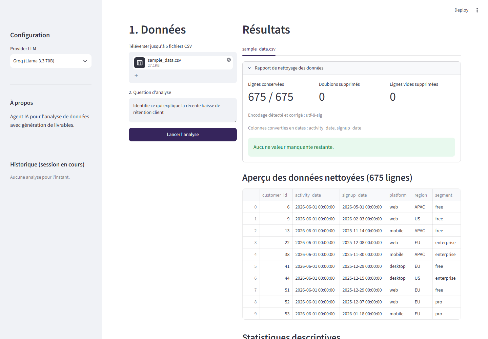

# ai-data-agent

> **In English.** A LangGraph agent that analyses a CSV the way an analyst would: it frames the business question, inspects the data, then **stops and waits for a person to approve the plan** before computing anything. After approval it builds the metric, describes how the data is spread across categories, checks the results, drafts recommendations, and exports an Excel workbook and a PowerPoint deck. Streamlit interface, command line and MCP server, 192 automated tests with CI. SQL written by the model runs on a read-only DuckDB connection with no access to files. [Live demo](https://ai-data-agent-version1.streamlit.app/): it opens on the full agent, and a button loads a sample dataset, so you can reach the approval step without a file of your own. I built it with AI coding assistants and stay responsible for the design choices, the tests and the validation. The rest of this README is in French.

**Étude de cas : donner à une IA la discipline d'un analyste senior, pas seulement l'accès à une base de données.**

## Le problème

Un outil « text-to-SQL » classique répond vite et se trompe silencieusement : il saute directement à la requête, produit un chiffre plausible, et personne ne voit qu'il a mal cadré la question, ignoré un biais dans les données, ou halluciné une tendance qui n'existe pas. Sur un cas d'usage métier réel, comme une baisse de rétention ou une anomalie dans un flux de facturation, cette confiance mal placée coûte plus cher que l'attente d'une réponse correcte.

## La décision de conception

Plutôt que de faire produire une réponse en une seule passe à un LLM, `ai-data-agent` force un déroulé d'analyste : cadrer le problème avant de calculer, inspecter les données, **s'arrêter et attendre une validation humaine explicite** avant de lancer l'analyse, construire la métrique, décrire la répartition des données, valider, puis seulement recommander. Le compromis assumé : l'agent est plus lent qu'une réponse en une passe, en échange d'une garantie qu'aucune étape ne s'exécute sans qu'un humain ait vu ce qui va être calculé.

Ce point d'arrêt n'est pas un `input()` de confort : c'est un vrai point d'interruption LangGraph (`interrupt_before`). L'état est sauvegardé, l'approbation peut arriver plus tard, l'analyse reprend exactement où elle s'était arrêtée, et chaque étape laisse une trace dans le journal d'audit.

## Le résultat

Un agent en 8 étapes (cadrage → inspection → **approbation humaine** → construction → répartition → validation → recommandations → export), utilisable en CLI ou via une interface Streamlit, avec un serveur MCP qui expose la même base à n'importe quel assistant IA compatible (Claude Desktop, VS Code…). 192 tests automatisés (93 % de couverture), et des garde-fous de sécurité trouvés et corrigés en cours de route : protection contre l'injection SQL, lecture de fichiers bloquée pour le SQL écrit par le LLM, neutralisation des formules dans les exports Excel/CSV.

**🔗 Démo en ligne : [ai-data-agent-version1.streamlit.app](https://ai-data-agent-version1.streamlit.app/)**

> **Deux interfaces, un même agent.** L'**agent LangGraph en 8 étapes** s'exécute en CLI via `python -m agent.main`, ou depuis l'**application Streamlit** (`app.py`), qui s'ouvre sur le mode « Agent complet » ; le bouton « Essayer avec les données d'exemple » permet d'aller jusqu'à l'étape d'approbation sans fichier à soi. L'app garde aussi son mode « Analyse simple » d'origine (analyse LLM en une seule passe, sans le graphe) pour une utilisation rapide sur n'importe quel CSV (voir la section [Utilisation](#utilisation)).

---

## Fonctionnalités

- **Workflow d'agent en 8 étapes** orchestré par LangGraph avec état typé (Pydantic) et checkpointing SQLite, accessible en CLI et depuis l'interface Streamlit.
- **Point de contrôle humain réel** (human-in-the-loop) après l'inspection des données : le graphe est compilé avec `interrupt_before`, un vrai mécanisme de pause/reprise LangGraph, pas un `input()` bloquant dans le nœud. En CLI, la décision se saisit dans le terminal ; dans Streamlit, via deux boutons (« Approuver » / « Rejeter »).
- **Inspection automatique des données** : schéma, volumétrie, plage de dates, valeurs manquantes, doublons, besoin d'agrégation, et détection de la colonne identifiant une entité (ex. `customer_id`) si elle existe.
- **Agnostique au schéma** : `build`/`test`/`validate` s'adaptent aux colonnes réellement présentes (identifiant d'entité et colonne de date détectés automatiquement, sinon repli sur un simple comptage de lignes) plutôt que de supposer un schéma de rétention client fixe.
- **Répartition par dimension** : pour chaque colonne catégorielle disponible (plateforme, région, segment, ou toute autre colonne du CSV), le nombre d'entités par catégorie, avec un test du chi² d'ajustement qui indique si les effectifs sont inégaux entre catégories (p < 0.05). C'est une description de l'échantillon, pas une analyse de facteurs explicatifs : l'étape ne compare pas la métrique entre catégories, et le prompt des recommandations interdit de présenter une dimension comme une cause sur cette base. Les colonnes trop fragmentées (plus de 30 catégories distinctes, ex. un commentaire libre ou un second identifiant) sont exclues du test plutôt que de produire un faux signal statistique.
- **Étape de validation** : rapprochement des comptes, vérification de reproductibilité et de cohérence des résultats.
- **Recommandations classées** par impact, faisabilité et délai.
- **Export automatique Excel/PowerPoint** : le dernier nœud du graphe régénère un classeur Excel (métrique construite, un onglet par dimension, validation) et une présentation PowerPoint à partir des résultats réels de l'analyse, puis vérifie automatiquement que les chiffres des deux fichiers concordent.
- **Chat de suivi sur les résultats** (mode Agent complet) : une fois l'analyse terminée, une question en langage naturel peut être posée dans un chat sous les résultats. L'assistant décide lui-même s'il doit interroger la table DuckDB de l'analyse pour répondre (ex. « combien de clients uniques sur mobile ? ») ou s'appuyer directement sur le résumé déjà calculé. La requête SQL générée passe par le même garde-fou que le serveur MCP (lecture seule, sans accès aux fichiers, voir Sécurité), et elle est affichée à côté de la réponse.
- **Téléchargement des données nettoyées avec statistiques descriptives** : dans les deux modes, un bouton « Télécharger les données nettoyées » régénère un classeur Excel avec, pour chaque fichier analysé, sa feuille de données suivie d'une feuille `df.describe()` (mêmes statistiques que celles déjà affichées à l'écran). En mode agent, les données sont relues depuis la table DuckDB de l'analyse (donnée unique ou jointe selon le mode choisi).
- **Pipeline de streaming** : surveillance d'un dossier (watchdog) qui déclenche une analyse à l'arrivée d'un nouveau fichier, mais uniquement quand le détecteur d'anomalies par z-score (`AnomalyDetector`) juge la volumétrie anormale (ou, au tout début, tant qu'il n'a pas assez d'historique pour juger), et pas à chaque fichier reçu. Deux modes explicites : approbation automatique (`require_approval=False`, par défaut) ou mise en attente explicite (`require_approval=True`, avec `pipeline.approve(thread_id)` / `.reject(thread_id)`). Les livrables Excel/PowerPoint de chaque analyse terminée sont copiés dans `./outputs/stream/` sous un nom dérivé du fichier source.
- **Serveur MCP DuckDB** : expose la base analytique aux assistants IA compatibles MCP. `execute_query` est restreint aux requêtes de lecture (`SELECT`/`WITH`/`DESCRIBE`/`SHOW`/`EXPLAIN`, une seule instruction), exécutées sur une connexion en lecture seule sans accès aux fichiers : un assistant externe ne peut ni modifier la base ni lire un fichier de la machine via cet outil.
- **Interface Streamlit** : deux modes sélectionnables. « Agent complet », ouvert par défaut (le workflow LangGraph en 8 étapes ci-dessus, avec un onglet indépendant par fichier téléversé : cadrage, inspection, validation humaine et livrables propres à chacun), et « Analyse simple » (upload jusqu'à 5 fichiers CSV, nettoyage automatique, analyse LLM en une passe, export Markdown / CSV / Excel / PowerPoint). Un bouton charge le jeu d'exemple `data/sample_data.csv` pour essayer sans fichier à soi. Chaque session Streamlit utilise ses propres fichiers DuckDB/checkpoint pour ne pas interférer avec les autres utilisateurs d'un déploiement partagé.
- **Multi-provider LLM avec repli en cascade** : Groq, OpenRouter, Mistral essayés dans l'ordre (chacun avec sa propre clé, celle demandée en premier) ; Gemini reste utilisable si explicitement demandé mais exclu du repli automatique (accès payant sur de nombreux comptes désormais). Modèle Groq par défaut : `openai/gpt-oss-120b`, Groq ne proposant plus `llama-3.3-70b-versatile`. Un quota épuisé ou une panne se traduit par un avertissement clair côté utilisateur (pas une trace d'erreur brute) tant qu'au moins un autre provider est configuré.
- **Sécurité** : identifiants SQL (colonnes/tables) et chemins de fichiers systématiquement échappés/paramétrés avant toute requête DuckDB : ni le contenu ni le nom d'un CSV téléversé ne peuvent injecter du SQL (voir `agent/tools/data_loader.py`). Le SQL écrit par le LLM (chat de suivi) ou par un client MCP passe par une regex de lecture seule, puis s'exécute sur une connexion DuckDB en lecture seule, sans accès externe et à configuration verrouillée (`fetch_untrusted_dataframe()`) : une requête comme `SELECT content FROM read_text('/etc/passwd')`, que la regex seule laissait passer, est refusée par le moteur. Neutralisation des injections de formule CSV/Excel (CWE-1236) sur tous les exports, **en-têtes de colonnes compris** (pas seulement les valeurs de cellules) ; lecture CSV robuste (encodage et séparateur devinés, colonnes lues en texte brut pour ne pas perdre les zéros non significatifs avant le nettoyage).

---

## Architecture

Le cœur du système est un graphe LangGraph. Après l'inspection, une arête conditionnelle renvoie vers un point de contrôle humain ; l'analyse ne se poursuit qu'après approbation.

```text
Cadrage → Inspection → [Approbation humaine] → Construction → Répartition → Validation → Recommandations → Export
                            │ (rejet)
                            └────────────► Fin
```

| Étape | Nœud | Rôle |
| --- | --- | --- |
| 1. Cadrage | `framing` | Définit la métrique, reformule la question, fixe la période de comparaison et les hypothèses |
| 2. Inspection | `inspection` | Charge les données dans DuckDB et en extrait les métadonnées |
| 3. Approbation | `approval` | Attend une validation humaine explicite |
| 4. Construction | `build` | Calcule une métrique agrégée via DuckDB (évolution dans le temps si une colonne date existe, sinon un total) |
| 5. Répartition | `test` | Compte les entités par catégorie pour chaque dimension, avec un test du chi² d'ajustement (effectifs égaux ou non). Décrit l'échantillon, sans comparer la métrique entre catégories |
| 6. Validation | `validate` | Rapproche les comptes et vérifie la cohérence |
| 7. Recommandations | `recommend` | Formule des recommandations actionnables classées, sans présenter une dimension comme une cause sur la base du chi² |
| 8. Export | `export` | Génère le classeur Excel et la présentation PowerPoint à partir des résultats réels, et vérifie leur cohérence |

Un schéma détaillé est disponible dans [`docs/architecture.svg`](docs/architecture.svg).

### Stack technique

| Domaine | Technologie |
| --- | --- |
| Orchestration d'agent | LangGraph 1.1 + LangChain Core |
| Persistance de l'état | SQLite (checkpointer LangGraph) |
| Moteur analytique | DuckDB |
| Accès LLM | LiteLLM (Groq, Gemini, OpenRouter, Mistral) |
| Interface web | Streamlit |
| Interopérabilité IA | Serveur MCP (Model Context Protocol) |
| Streaming | watchdog + détection d'anomalies (NumPy, z-score) |
| Livrables | openpyxl (Excel), python-pptx (PowerPoint) |
| Données | pandas |

---

## Installation

Prérequis : Python 3.11+.

```bash
# Cloner le dépôt
git clone https://github.com/Nyamey/ai-data-agent.git
cd ai-data-agent

# Créer un environnement virtuel
python -m venv .venv
source .venv/bin/activate        # Windows : .venv\Scripts\activate

# Installer les dépendances
pip install -r requirements.txt

# Configurer les clés API
cp .env.example .env
# puis éditez .env avec au moins une clé (Groq, Gemini, OpenRouter ou Mistral)
```

### Configuration

Copiez `.env.example` en `.env` et renseignez au moins une clé API :

```env
GROQ_API_KEY=gsk_votre_cle_ici
GOOGLE_API_KEY=votre_cle_ici
OPENROUTER_API_KEY=sk-or_votre_cle_ici
MISTRAL_API_KEY=votre_cle_ici

DEFAULT_LLM_PROVIDER=groq
DUCKDB_PATH=./data/analytics.duckdb
```

---

## Utilisation

### Interface web (Streamlit)

```bash
streamlit run app.py
```



La barre latérale propose deux modes :

- **Agent complet (8 étapes)**, ouvert par défaut : lance le même workflow LangGraph que la ligne de commande, sur jusqu'à 5 fichiers, ou sur le jeu d'exemple avec le bouton « Essayer avec les données d'exemple ». Deux façons d'analyser plusieurs fichiers :
  - **Indépendamment** (par défaut) : chaque fichier obtient son propre onglet et son propre cycle complet (cadrage/inspection/approbation/résultats), totalement indépendant des autres.
  - **Croisés par jointure** : les fichiers sont chargés dans une seule table DuckDB jointe et analysés en un seul cycle. Pas de détection automatique de clé (trop fragile) : vous choisissez un fichier racine, puis pour chaque autre fichier, à quel fichier déjà ajouté il se rattache et sur quelles colonnes, ce qui construit un arbre de jointure sans limite de fichiers. Chaque étape peut être une jointure `inner` (ne garde que les lignes avec correspondance de chaque côté, recommandé pour croiser plusieurs fichiers sans faire exploser le résultat en `NULL`) ou `left` (garde aussi les lignes du fichier déjà ajouté sans correspondance). Sans détection automatique de clé, rien n'empêche de choisir des colonnes qui ne se correspondent pas réellement : l'inspection compare alors le nombre de lignes obtenu à celui de chaque fichier source et affiche un avertissement explicite si la jointure semble avoir échoué (0 ligne : aucune valeur en commun ; bien plus de lignes qu'aucun fichier source : colonne choisie non unique), avant de gaspiller le reste de l'analyse dessus. Si les deux colonnes n'ont même pas un type compatible (ex. une colonne date jointe à une colonne de texte), la jointure échoue immédiatement avec un message clair l'expliquant, plutôt que l'erreur DuckDB brute.

  Dans les deux cas : cliquez sur « Lancer le cadrage et l'inspection », consultez le résumé affiché, puis approuvez ou rejetez la poursuite de l'analyse : le graphe reprend exactement où il s'est arrêté, sans `input()` ni rechargement de page, avec l'étape en cours (construction, répartition, validation...) affichée pendant l'exécution. Une fois l'analyse terminée, les livrables Excel et PowerPoint générés par l'agent sont téléchargeables directement depuis l'onglet, et un chat permet de poser des questions de suivi sur les résultats (l'assistant peut interroger directement la table DuckDB de l'analyse si la question l'exige).
- **Analyse simple** : chargez jusqu'à 5 fichiers CSV, laissez l'application les nettoyer et les analyser (analyse LLM en une passe), puis exportez le résultat en Markdown, CSV, Excel ou PowerPoint.

### Agent en ligne de commande

```bash
python -m agent.main
```

Cette commande lance directement une démo sur [`data/sample_data.csv`](data/sample_data.csv), un jeu de données synthétique (675 lignes, schéma `customer_id` / `activity_date` / `signup_date` / `platform` / `region` / `segment`) qui simule une baisse de rétention sur les deux dernières semaines côté mobile, reproductible et prêt à l'emploi sans configuration.

Ou dans votre code, avec vos propres données :

```python
from agent.main import run_analysis

run_analysis(
    query="Comment a évolué la rétention hebdomadaire des clients ces dernières semaines ?",
    data_path="chemin/vers/vos_donnees.csv",
    language="fr",
)
```

L'agent s'interrompra après l'inspection (le graphe est compilé avec `interrupt_before=["approval"]`) et affichera une invite `oui/non` dans le terminal pour vous demander d'approuver la poursuite de l'analyse. `run_analysis()` accepte aussi `db_path`, `checkpoint_path` et `llm_provider` en option, pour isoler des exécutions concurrentes ou forcer un provider LLM précis.

### Pipeline de streaming

```python
from agent.streaming.pipeline import StreamingAnalysisPipeline

# require_approval=False (par défaut) : contourne l'approbation humaine
# automatiquement dès que le graphe s'y arrête, pour un pipeline non supervisé.
pipeline = StreamingAnalysisPipeline(watch_dir="./data/stream")
pipeline.start()
```

Déposez un CSV dans le dossier surveillé : une analyse n'est déclenchée que si le détecteur d'anomalies juge la volumétrie du nouveau fichier anormale par rapport à l'historique récent (ou, au tout début, tant qu'il n'a pas assez de données pour en juger), et pas à chaque fichier reçu. Avec `require_approval=True`, l'analyse déclenchée reste en attente dans `pipeline.pending` jusqu'à un appel explicite à `pipeline.approve(thread_id)` ou `pipeline.reject(thread_id)`.

Quand une analyse va au bout (approuvée), ses livrables Excel/PowerPoint (générés par le même `export_node` que les modes CLI/Streamlit) sont copiés dans `./outputs/stream/` sous un nom dérivé du fichier source (ex. `ventes_quotidiennes_rapport_20260101_120000.xlsx`), et leur chemin est affiché dans la sortie du pipeline (configurable via `deliverables_dir`).

### Serveur MCP

```bash
python -m mcp_server.server
```

Le serveur expose DuckDB via le Model Context Protocol, ce qui permet à un assistant IA compatible (Claude Desktop, VS Code…) d'interroger directement la base.

---

## Structure du projet

```text
ai-data-agent/
├── agent/
│   ├── graph.py            # Assemblage du graphe LangGraph
│   ├── state.py            # Schéma d'état (Pydantic)
│   ├── main.py             # Point d'entrée de l'agent
│   ├── nodes/              # Les 8 nœuds du workflow (dont export.py)
│   ├── tools/              # Chargement de données (DuckDB), sécurité SQL, chat de suivi
│   ├── llm/                # Config LLM multi-provider + fallback
│   ├── output/             # Générateurs Excel / PPTX + vérification de cohérence
│   └── streaming/          # Surveillance de dossier + détection d'anomalies
├── mcp_server/             # Serveur MCP DuckDB
├── app.py                  # Interface Streamlit, coquille de page (config, barre latérale, upload/nettoyage)
├── agent_ui.py             # Mode « Agent complet » : jointure, cycle d'approbation, résultats
├── simple_mode_ui.py       # Mode « Analyse simple » : cascade LLM, résultat, export
├── ui_helpers.py           # Widgets d'affichage partagés entre les deux modes
├── app_utils.py            # Fonctions pures (nettoyage, exports, sécurité), testables sans Streamlit
├── tests/                  # Suite pytest (voir ci-dessous), dont streamlit_scripts/ pour les tests d'intégration
├── .github/workflows/      # Intégration continue (GitHub Actions)
├── docs/                   # Diagramme d'architecture (Mermaid + SVG) et capture d'écran
├── data/
│   └── sample_data.csv     # Jeu de données d'exemple (seul fichier de data/ suivi par git)
├── requirements.txt
├── CONTRIBUTING.md
├── LICENSE
└── README.md
```

---

## Tests

```bash
pip install -r requirements.txt
python -m pytest tests/ -v

# Couverture par module (utile pour repérer les zones sous-testées) :
python -m pytest tests/ --cov=agent --cov=app_utils --cov=agent_ui --cov=simple_mode_ui --cov=ui_helpers --cov=mcp_server --cov-report=term-missing
```

192 tests, 93 % de couverture sur `agent/`, `app_utils.py`, `agent_ui.py`, `simple_mode_ui.py`, `ui_helpers.py` et `mcp_server/` combinés. La suite couvre le nettoyage/export de données, le chargement DuckDB et la détection de schéma (fichier seul et jointure multi-fichiers, y compris les régressions de sécurité SQL décrites ci-dessus), l'extraction de JSON depuis une réponse LLM imparfaite, tous les nœuds de l'agent, y compris `framing`/`recommend` (qui appellent un LLM) et `export` (génération Excel/PowerPoint), le contrôle de répartition (chi² d'ajustement) et son garde-fou de cardinalité, le repli entre providers LLM, le point d'entrée CLI (`agent/main.py`), la restriction du SQL non fiable du serveur MCP et du chat de suivi (écritures refusées, lecture de fichiers par `read_text`/`read_csv`/`glob` bloquée, configuration verrouillée), la décision de déclenchement du pipeline de streaming et l'organisation de ses livrables, les générateurs Excel/PowerPoint et la vérification de cohérence entre les deux.

Pour `framing`/`recommend`, seul l'appel réseau est simulé (`litellm.completion`, avec des réponses représentatives d'un vrai modèle : JSON dans un bloc ```json, ou texte libre sans JSON) : `get_llm_response()`, l'extraction JSON et la logique des nœuds tournent pour de vrai, sans dépendre d'un provider externe ni de sa disponibilité du jour. Le même principe s'applique au point d'entrée CLI et aux tests d'intégration de l'interface (`tests/test_app_integration.py`) : ils pilotent réellement les widgets Streamlit (radio, sélecteurs, clics) via `AppTest`, avec le graphe LangGraph remplacé par un faux graphe déterministe (`tests/streamlit_scripts/`), pour vérifier dans l'interface l'inspection, l'isolation entre fichiers, la jointure, le chargement du jeu d'exemple et l'affichage d'un quota épuisé sans dépendre du réseau. Une intégration continue (GitHub Actions, [`.github/workflows/tests.yml`](.github/workflows/tests.yml)) exécute cette suite sur Python 3.11 et 3.12 à chaque push/PR sur `main`, sans clé API requise.

---

## Roadmap

Étapes réalisées :

- [x] Connecter l'interface Streamlit à l'agent en 8 étapes (mode « Agent complet »)
- [x] Porter l'approbation human-in-the-loop dans l'interface Streamlit (boutons Approuver/Rejeter)
- [x] Passer à un vrai point d'interruption LangGraph (`interrupt_before`) plutôt qu'un `input()` bloquant
- [x] Rendre le calcul de la métrique agnostique au schéma (détection automatique de colonne identifiant/date, repli sur un comptage de lignes sinon)
- [x] Recueillir automatiquement (ou explicitement contourner) l'approbation humaine dans le pipeline de streaming, et brancher `AnomalyDetector` sur la décision de déclenchement
- [x] Contrôle de répartition par dimension à l'étape 5 (chi² d'ajustement), présenté comme une description de l'échantillon
- [x] Brancher les générateurs Excel/PPTX sur la sortie de l'agent
- [x] Étendre le mode agent de Streamlit au multi-fichiers (un onglet indépendant par fichier)
- [x] Jeu de données d'exemple et démo reproductible (`data/sample_data.csv`), accessible d'un clic dans l'interface
- [x] Suite de tests automatisés et intégration continue
- [x] Analyse croisée entre plusieurs fichiers liés (jointure configurable par l'utilisateur, jusqu'à 5 fichiers)
- [x] Couverture de tests des nœuds `framing`/`recommend` (réponse LLM simulée, reste de la chaîne réel)
- [x] Export des livrables du pipeline de streaming (copiés dans `./outputs/stream/`, nommés d'après le fichier source)
- [x] Restriction en lecture seule du serveur MCP et garde-fou de cardinalité sur le chi² (voir Sécurité et Répartition par dimension)
- [x] SQL écrit par le LLM ou par un client MCP exécuté sur une connexion en lecture seule, sans accès aux fichiers
- [x] Chat de suivi sur les résultats avec accès direct à DuckDB (mode Agent complet)
- [x] Téléchargement des données nettoyées avec feuille de statistiques descriptives par fichier (deux modes)

Prochaine étape :

- [ ] Comparer la métrique elle-même entre catégories et entre deux périodes, pour tester réellement si une dimension explique une évolution, au lieu du seul contrôle de répartition

---

## Licence

Distribué sous licence **MIT**. Voir le fichier [`LICENSE`](LICENSE).

## Auteur

**Karen EKIYABE NYAMEY** ([@Nyamey](https://github.com/Nyamey))
